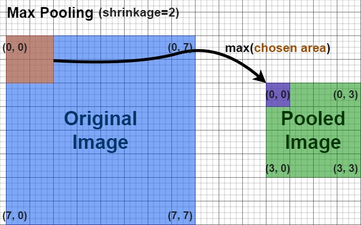
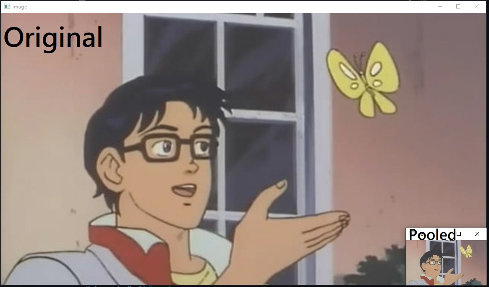
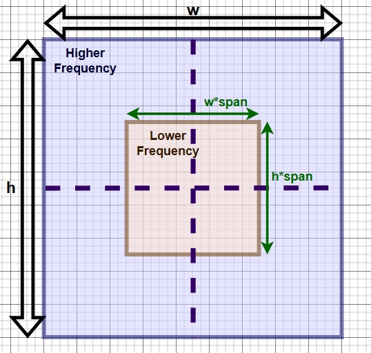
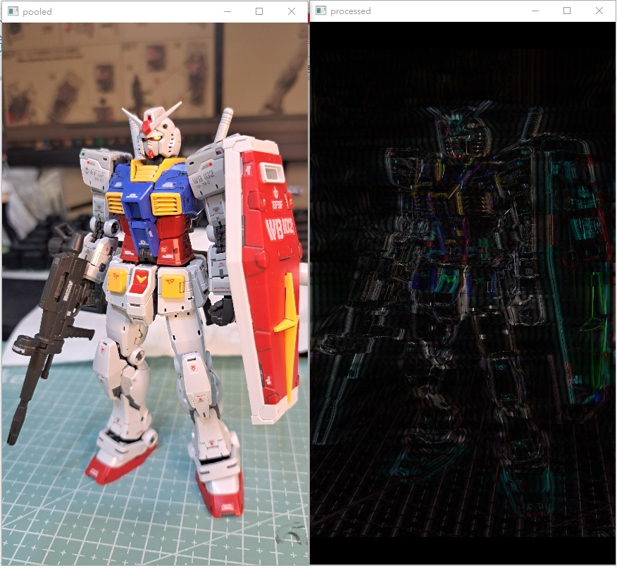

<br />
<div align="center">
  <h1 align="center">Digital Image Processing</h1>
  <h2 align="center">The current repository is still in construction and the contents may change in the future!</h2>
  
    
  </p>
</div>

(English is not my first language, so it may be hard to read this page. Sorry (/ _ \).)

I started this project to process photos taken for my gunplas, originally. A bunch of methods are employed, and most of them are self-taught products.

Following are some funciton I used:

## pooling(image, shrinkage)


```
import cv2
import random
import scipy.fftpack as sfft
import scipy.ndimage as simg
import numpy as np
from scipy import signal as scisig

img = cv2.imread('is_this_a_pigeon.jpg') 
img_ds = pooling(img, shrinkage=6)
cv2.imshow('image',img)
cv2.imshow('pooled', img_ds)
cv2.waitKey(0)
cv2.destroyAllWindows()
```




<h3> 
Make sure scale your image's pixel values to [0, 1] before using functions below.
</h3> 

## pass_filter(image, span=0.1, pass_type='low')

### A boundary box is utilized to mark the "passing area". 
* If pass_type = 'low', then low-frequency components (outer area) are kept.
* If pass_type = 'high', then high-frequency components (inner area) are kept.



```
img = cv2.imread('gundam_rg_2.jpg')
img_ds = pooling(img, shrinkage=6)
img = img / 255
img_ds = img_ds / 255
img_processed = np.copy(img_ds)
pass_filter(img_processed, span=0.9, pass_type='high')
cv2.imshow('pooled', img_ds)
cv2.imshow('processed', img_processed)
cv2.waitKey(0)
cv2.destroyAllWindows()
```


