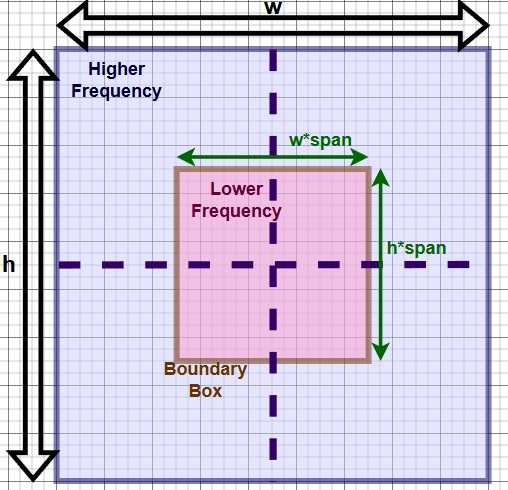
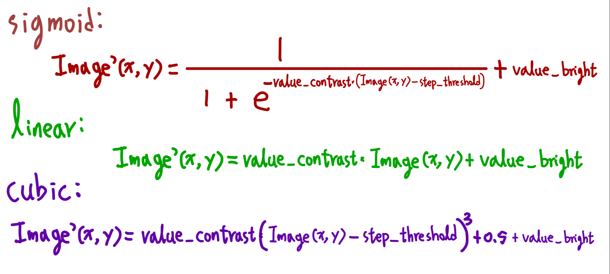

<br />
<div align="center">
  <h1 align="center">Digital Image Processing</h1>
  <h2 align="center">The current repository is still in construction and the contents may change in the future!</h2>
  
    
  </p>
</div>

(English is not my first language, so it may be hard to read this page. Sorry (/ _ \).)

I started this project to process photos taken for my gunplas, originally. A bunch of methods are employed, and most of them are self-taught products.

Following are some methods I used:

## pooling(image, shrinkage)


```
import cv2
import random
import scipy.fftpack as sfft
import scipy.ndimage as simg
import numpy as np
from scipy import signal as scisig

img = cv2.imread('is_this_a_pigeon.jpg') 
img_ds = pooling(img, shrinkage=6)
cv2.imshow('image',img)
cv2.imshow('pooled', img_ds)
cv2.waitKey(0)
cv2.destroyAllWindows()
```


<h3> 
Make sure scale your image's pixel values to [0, 1] before using functions below.
</h3> 

## pass_filter(image, span, pass_type)

([Reference for fft of 2-D array](https://docs.scipy.org/doc/scipy/reference/generated/scipy.fftpack.fft2.html "link" )) 

### A boundary box is utilized to mark the "passing area". 
* If pass_type = 'low', then low-frequency components (outer area) are kept.
* If pass_type = 'high', then high-frequency components (inner area) are kept.



```
img = cv2.imread('gundam_rg_2.jpg')
img_ds = pooling(img, shrinkage=6)
img = img / 255
img_ds = img_ds / 255
img_processed = np.copy(img_ds)
pass_filter(img_processed, span=0.9, pass_type='high')
cv2.imshow('pooled', img_ds)
cv2.imshow('processed', img_processed)
cv2.waitKey(0)
cv2.destroyAllWindows()
```


## histogram(image, channel_order)
```
histogram(img_ds, channel_order='BGR')
```


## negatives(image)
```
img_processed = np.copy(img_ds)
negatives(img_processed)
cv2.imshow('pooled', img_ds)
cv2.imshow('processed', img_processed)
cv2.waitKey(0)
cv2.destroyAllWindows()
```


## log_transform(image, c)
### new_image(x, y) = c * log(1 + image(x, y))
```
img_processed = np.copy(img_ds)
log_transform(img_processed, c=2)
cv2.imshow('pooled', img_ds)
cv2.imshow('processed', img_processed)
cv2.waitKey(0)
cv2.destroyAllWindows()
histogram(img_ds, channel_order='BGR')
```


## DCT(image, shape_result, norm, process_type, pass_rate, pass_quadrant)

([Reference for Discrete Cosine Transformation](https://users.cs.cf.ac.uk/Dave.Marshall/Multimedia/node231.html "link" )) 
([Reference for Discrete Cosine Transformation 2](https://docs.scipy.org/doc/scipy/reference/generated/scipy.fftpack.dctn.html "link" )) 

### Another method to low/high-pass an image.


```
img_processed = np.copy(img_ds)
DCT(img_processed, shape_result=None, norm='ortho', process_type='pass', pass_quadrant='234', pass_rate=0.1)
cv2.imshow('pooled', img_ds)
cv2.imshow('processed', img_processed)
cv2.waitKey(0)
cv2.destroyAllWindows()
```


## edge_detect_laplace(image, direction)

([Reference](https://medium.com/@wilson.linzhe/digital-image-processing-in-c-chapter-4-edge-detection-and-grayscale-transformation-laplacian-dfb8de02f213 "link" )) 

```
img_processed = np.copy(img_ds)
edge_detect_laplace(img_processed, direction='45_degree')
cv2.imshow('pooled', img_ds)
cv2.imshow('processed', img_processed)
cv2.waitKey(0)
cv2.destroyAllWindows()
```


## median_filter(image, window_size, step_size)


```
img_noised = np.copy(img_ds)
salt_pepper(img_noised)
img_processed = np.copy(img_noised)
median_filter(img_processed, window_size=3, step_size=1)
cv2.imshow('noised', img_noised)
cv2.imshow('processed', img_processed)
cv2.waitKey(0)
cv2.destroyAllWindows()
```


## contrast(image, value_contrast, value_bright, mode, step_threshold)




```
img_processed = np.copy(img_ds)
contrast(img_processed, mode='sigmoid', value_contrast=10, step_threshold=0.5)
histogram(img_processed, channel_order='BGR') 
cv2.imshow('pooled', img_ds)
cv2.imshow('processed', img_processed)
cv2.waitKey(0)
cv2.destroyAllWindows()
```


## gaussian_filter(image, sigma, radius, derivative)
([Reference](https://docs.scipy.org/doc/scipy/reference/generated/scipy.ndimage.gaussian_filter.html "link" )) 

```
img_processed = np.copy(img_ds)
gaussian_filter(img_processed, sigma=7, radius=1, derivative=0)
cv2.imshow('pooled', img_ds)
cv2.imshow('processed', img_processed)
cv2.waitKey(0)
cv2.destroyAllWindows()
```


